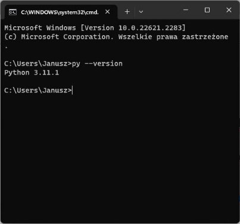

# Pracownia Programowania 1

## Computer Programming 1

### Course Introduction (PP1/CP1)

**Communication with Teacher:**
1. Course forum on Microsoft Teams
2. Microsoft Teams chat
3. Office Hours (details on teacher’s e-card)
4. Email (details on teacher’s e-card)

**Teacher’s e-card:** [Course Link](https://e-uczelnia.uek.krakow.pl/course/view.php?id=218)

### Course Details

**Course Content**

#### Main Class Topics
- **Part 1: PROGRAMMING BASICS** (variable, control structure, function)
- **Part 2: DATA STRUCTURES** (array, file, dictionary, set)
- **Part 3: PROGRAMMING PARADIGMS** (class, object, method)

### Checking Knowledge

**Tests Points**
- Test 1: 0-6
- Test 2: 0-7
- Test 3: 0-7
- **TOTAL: 0-20**

**Test retake:**
1. Generally impossible
2. Test completion ONLY for absent students
3. Absence confirmed by a sick leave (within 7 days)
4. At the end of the semester

### Final Grade

**Total Points Final Grade:**
- >= 18: 5.0
- >= 16: 4.5
- >= 14: 4.0
- >= 12: 3.5
- >= 10: 3.0
- < 10: 2.0

### Tools

**Source-Code Editor:** [Visual Studio Code](https://code.visualstudio.com)

**Version Control System:** [Git](https://git-scm.com)

**Programming Language:** [Python](https://www.python.org)

**Python Tutorials:**
- [Python for Everybody (book)](https://www.py4e.com/book)
- [Python Tutorial](https://docs.python.org/3/tutorial/index.html)
- [W3Schools Python Tutorial](https://www.w3schools.com/python/default.asp)
- [SoloLearn Python Course (for mobile devices)](https://play.google.com/store/apps/details?id=com.sololearn&hl=en)

### Internet Services

- Log in to Teams, Moodle, and Github

### Sign up for Course

**On Teams:**
1. Run Microsoft Teams
2. Log in to your account
3. Display team list
4. Select "Join a team"
5. Use a team code: `minz3eq`

**On Moodle:**
1. Log in to [Moodle](https://moodle.uek.krakow.pl)
2. Find the course "Pracownia Programowania 1 / Computer Programming 1"
3. Sign up for the course using your full group number (from University Schedule)

**On Github:**
1. Go to [Github](https://github.com)
2. Create an account or use your private account
3. In Github Settings, enter your real full name (first and last name)

### Make Copy of Class Materials

1. Log in to Github
2. Find the course materials (github repository) `stalj/pp1`
3. Fork (copy) the repository
4. Ensure you have your own private copy of the course materials on your Github account

### Homework

#### Tools Installation

**Watch the video:**
- [Python Tutorial for Beginners with VS Code by Dave Gray](https://youtu.be/6i3e-j3wSf0)

**Install Python:**
1. Install Python [Python Official Site](https://www.python.org)
2. Check Python on your computer
   - Open command prompt window
   - Enter command: `python --version` or `py --version`

**Install Visual Studio Code:**
1. Install Microsoft Visual Studio Code (VSCode)
2. Install VSCode extensions for Python (Microsoft)
3. Check Python working in VSCode
   - On your computer desktop, create a folder "TestPython"
   - Run VSCode
   - Open the created folder
   - In the folder, create a file `hello.py`
   - Enter Python statements as in the video
   - Run the program

**Install Git:**
1. Install Git Control Version System [Git Official Site](https://git-scm.com)
2. Check Git on your computer
   - Open command prompt window
   - Enter command: `git --version`

#### Course Materials

**Clone Your Course Repository:**
1. Find out how to use Git command `git clone`
2. Open command prompt window
3. Clone (copy) your own copy of the course repository (materials) from Github to your personal computer

**Read the Course Syllabus:**
1. In your local repository, open a folder `01-CourseIntroduction`
2. Familiarize yourself with the course syllabus `PP1-Syllabus.docx`
3. Find course textbooks "Python for Everybody" (Polish and English versions). Open those PDF documents. Read the table of contents.

**Prepare for the Next Class:**
1. In your local repository, open a folder `02-TypesAndVariables`
2. Open the document for the next class `02-TypesAndVariables.docx`
3. Complete all tasks contained in the section BEFORE CLASS

### To be continued

[ref1]: Aspose.Words.f7d92d11-bc25-40ae-878c-48cf52ea7008.002.png
[ref2]: Aspose.Words.f7d92d11-bc25-40ae-878c-48cf52ea7008.003.png
[ref3]: Aspose.Words.f7d92d11-bc25-40ae-878c-48cf52ea7008.007.png
